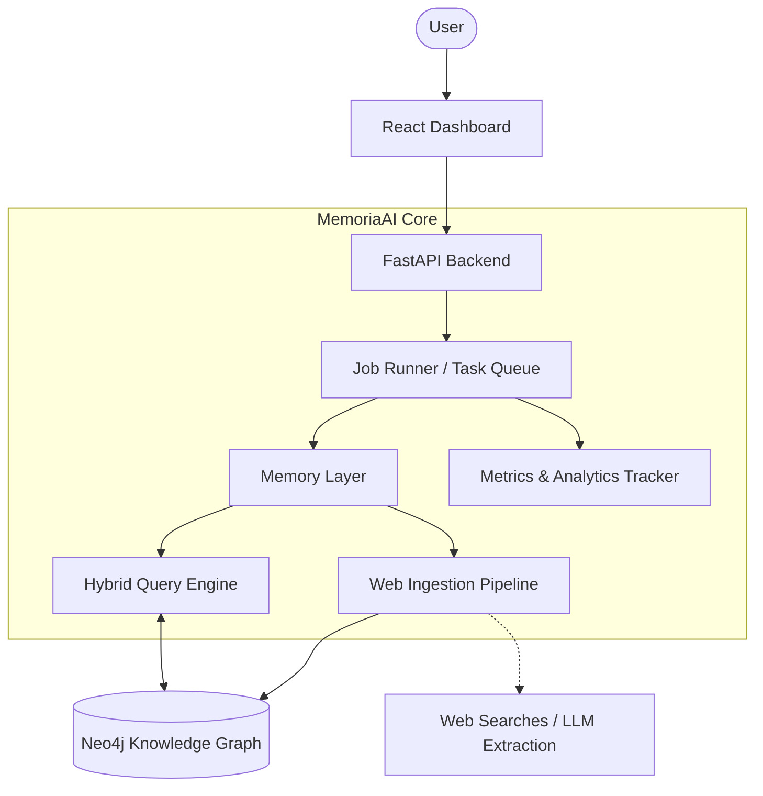
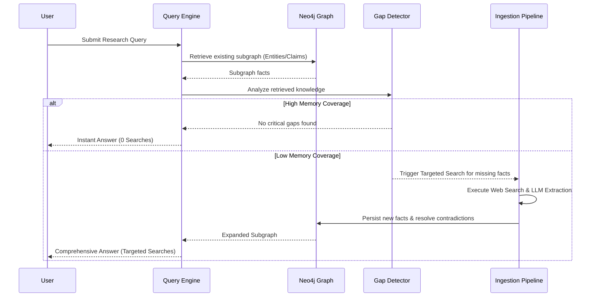
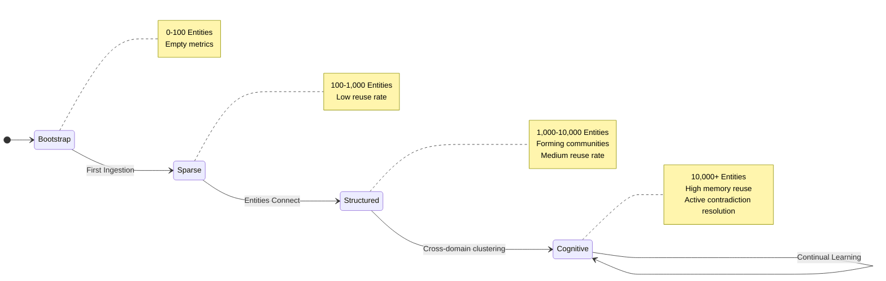

# MemoriaAI Architecture

## 1. System Diagram

```mermaid
flowchart TD
    User([User]) --> Frontend[React Dashboard]
    Frontend --> API[FastAPI Backend]
    
    subgraph MemoriaAI Core
        API --> JobRunner[Job Runner / Task Queue]
        JobRunner --> MemoryLayer[Memory Layer]
        JobRunner --> Observability[Metrics & Analytics Tracker]
        
        MemoryLayer --> QueryEngine[Hybrid Query Engine]
        MemoryLayer --> IngestionPipeline[Web Ingestion Pipeline]
    end
    
    QueryEngine <--> GraphDB[(Neo4j Knowledge Graph)]
    IngestionPipeline --> GraphDB
    IngestionPipeline -.-> Web[Web Searches / LLM Extraction]
```

## 2. Research Flow (Gap-Driven Search)

```mermaid
sequenceDiagram
    participant U as User
    participant Q as Query Engine
    participant G as Neo4j Graph
    participant D as Gap Detector
    participant I as Ingestion Pipeline
    
    U->>Q: Submit Research Query
    Q->>G: Retrieve existing subgraph (Entities/Claims)
    G-->>Q: Subgraph facts
    
    Q->>D: Analyze retrieved knowledge
    
    alt High Memory Coverage
        D-->>Q: No critical gaps found
        Q-->>U: Instant Answer (0 Searches)
    else Low Memory Coverage
        D-->>I: Trigger Targeted Search for missing facts
        I->>I: Execute Web Search & LLM Extraction
        I->>G: Persist new facts & resolve contradictions
        G-->>Q: Expanded Subgraph
        Q-->>U: Comprehensive Answer (Targeted Searches)
    end
```

## 3. Memory Evolution

```mermaid
stateDiagram-v2
    direction LR
    
    [*] --> Bootstrap
    
    Bootstrap --> Sparse: First Ingestion
    note right of Bootstrap
      0-100 Entities
      Empty metrics
    end note
    
    Sparse --> Structured: Entities Connect
    note right of Sparse
      100-1,000 Entities
      Low reuse rate
    end note
    
    Structured --> Cognitive: Cross-domain clustering
    note right of Structured
      1,000-10,000 Entities
      Forming communities
      Medium reuse rate
    end note
    
    Cognitive --> Cognitive: Continual Learning
    note right of Cognitive
      10,000+ Entities
      High memory reuse
      Active contradiction resolution
    end note
```
